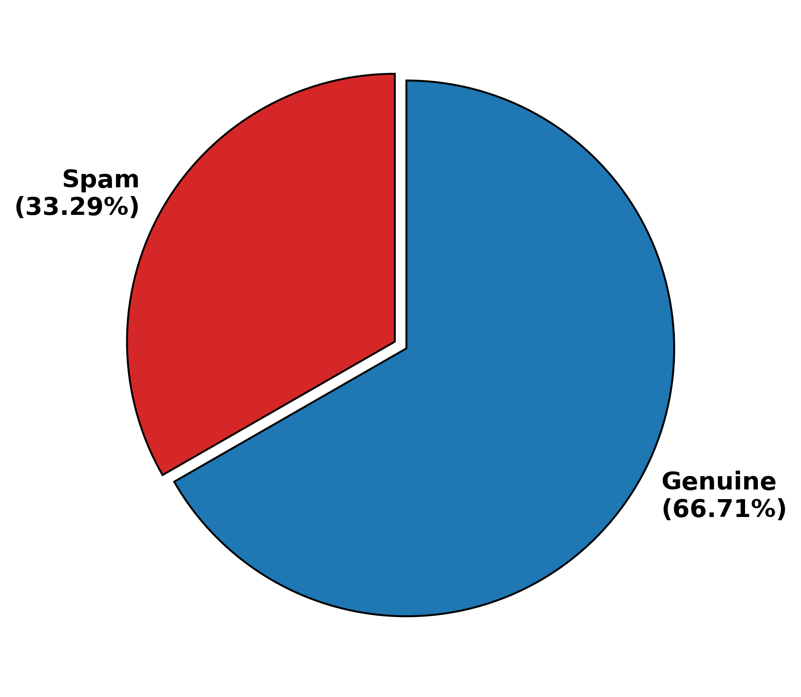
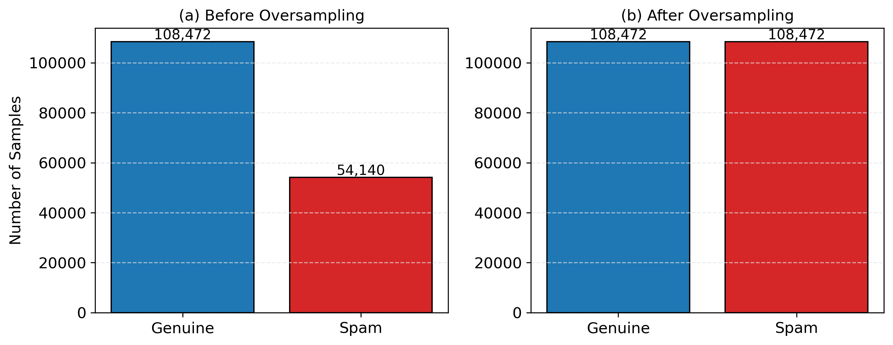
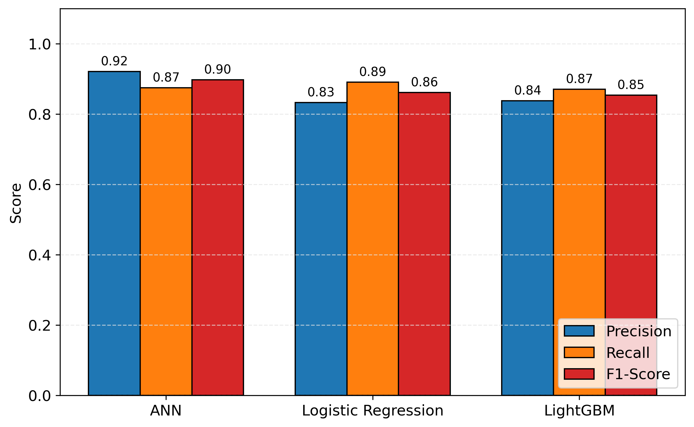
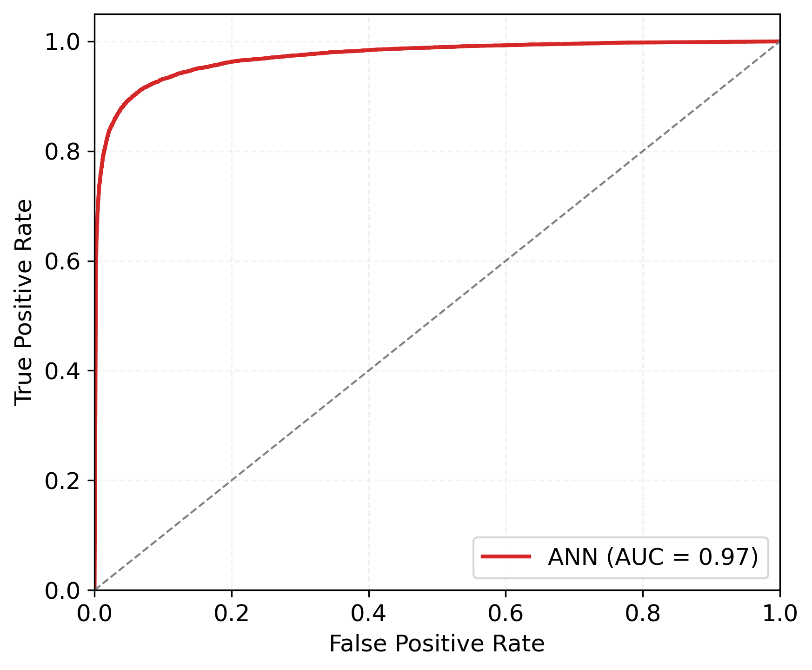
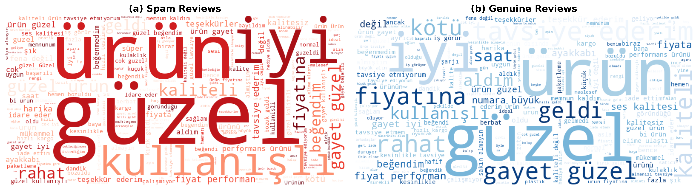
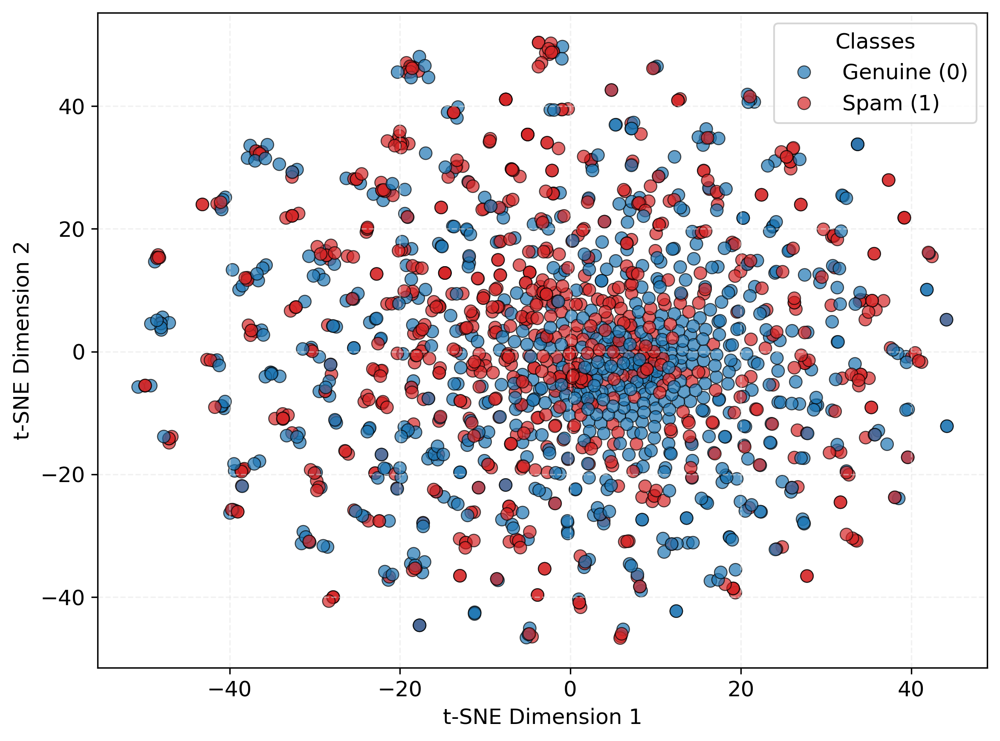
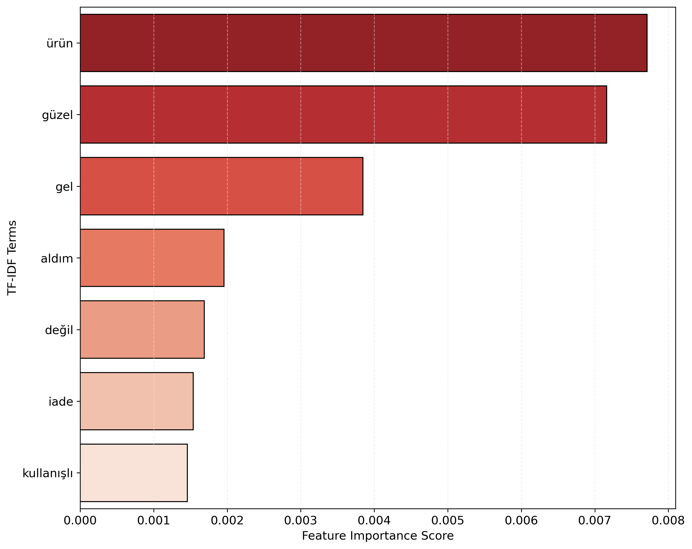

# Turkish Spam Detection System

A hybrid spam detection system for Turkish e-commerce reviews using BERTurk + TF-IDF feature fusion with weak supervision.



## Description

This project implements a machine learning pipeline for detecting spam in Turkish e-commerce product reviews. The system combines:

- **Weak Supervision**: Automatically generates training labels from heuristic spam signals (brevity, emoji density, URL presence, excessive capitalization, and punctuation patterns)
- **Hybrid Feature Fusion**: Concatenates BERT embeddings (from BERTurk) with TF-IDF features for richer text representation
- **Multi-Model Evaluation**: Compares 5 classification models (Logistic Regression, ANN, Random Forest, LightGBM, CART)
- **Comprehensive Visualizations**: Confusion matrices, AUC curves, t-SNE plots, word clouds, and feature importance analysis



## Installation

```bash
# Clone or navigate to the project directory
cd turkish-spam-detection_1

# Create virtual environment
python -m venv venv

# Activate virtual environment
# On Linux/macOS:
source venv/bin/activate
# On Windows:
venv\Scripts\activate

# Install dependencies
pip install -r requirements.txt
```

### Requirements

- Python 3.8+
- PyTorch
- Transformers (HuggingFace)
- scikit-learn
- LightGBM
- matplotlib, seaborn
- wordcloud (optional)

## Usage

### Running the Full Pipeline

```bash
# Execute the complete pipeline
python main.py
```

The pipeline will:
1. Load data from `data/veri_seti_200k.csv`
2. Apply weak supervision labeling based on spam signals
3. Extract hybrid features (TF-IDF + BERT with PCA)
4. Train and evaluate 5 classification models
5. Generate visualizations in the `results/` directory

### Configuration

Edit `config.py` to customize the following parameters:

| Parameter | Default | Description |
|-----------|---------|-------------|
| `DATA_PATH` | `data/veri_seti_200k.csv` | Input data file path |
| `BERT_MODEL` | `dbmdz/bert-base-turkish-cased` | BERT model for embeddings |
| `SAMPLE_SIZE` | `None` | Number of samples to process |
| `SPAM_THRESHOLD` | `0.8` | Weak labeling threshold |
| `TFIDF_FEATURES` | `500` | Maximum TF-IDF features |
| `PCA_COMPONENTS` | `256` | BERT dimensions after PCA |

### Model Comparison Results





### Visualizations Generated

The system generates 9 analysis plots saved to `results/`:

| File | Description |
|------|-------------|
| `1_label_distribution.png` | Distribution of spam vs ham labels |
| `2_oversampling_effect.png` | Impact of SMOTE oversampling |
| `3_best_model_cm.png` | Confusion matrix of best model |
| `4_top3_comparison.png` | Performance comparison of top 3 models |
| `5_auc_curve.png` | ROC-AUC curves for all models |
| `6_wordclouds.png` | Word clouds for spam and ham reviews |
| `7_tsne_plot.png` | t-SNE visualization of feature space |
| `8_pca_variance.png` | PCA variance explanation |
| `9_feature_importance.png` | Feature importance analysis |







## Project Structure

```
turkish-spam-detection_1/
├── config.py         # Configuration settings
├── preprocessing.py  # Turkish text cleaning and stemming
├── labeling.py       # Weak supervision heuristics
├── features.py       # TF-IDF and BERT feature extraction
├── train.py          # Model training and evaluation
├── visualize.py      # Analysis plots generation
├── main.py           # Pipeline orchestration
├── requirements.txt  # Python dependencies
├── data/             # Input data (not included in repo)
└── results/          # Generated visualizations
```

## Contributing

We welcome contributions! To contribute:

1. **Fork** the repository
2. **Create a feature branch** (`git checkout -b feature/YourFeature`)
3. **Make your changes** and ensure code follows existing patterns
4. **Test thoroughly** with the existing pipeline
5. **Commit** your changes (`git commit -m 'Add some feature'`)
6. **Push** to the branch (`git push origin feature/YourFeature`)
7. **Open a Pull Request** with a clear description of your changes

### Guidelines

- Follow PEP 8 style guidelines for Python code
- Add docstrings to new functions and classes
- Ensure new features work with the existing configuration system
- Test changes with the full pipeline before submitting

## License

This project is licensed under the **MIT License**.

```
MIT License

Copyright (c) 2026 Turkish Spam Detection Contributors

Permission is hereby granted, free of charge, to any person obtaining a copy
of this software and associated documentation files (the "Software"), to deal
in the Software without restriction, including without limitation the rights
to use, copy, modify, merge, publish, distribute, sublicense, and/or sell
copies of the Software, and to permit persons to whom the Software is
furnished to do so, subject to the following conditions:

The above copyright notice and this permission notice shall be included in all
copies or substantial portions of the Software.

THE SOFTWARE IS PROVIDED "AS IS", WITHOUT WARRANTY OF ANY KIND, EXPRESS OR
IMPLIED, INCLUDING BUT NOT LIMITED TO THE WARRANTIES OF MERCHANTABILITY,
FITNESS FOR A PARTICULAR PURPOSE AND NONINFRINGEMENT. IN NO EVENT SHALL THE
AUTHORS OR COPYRIGHT HOLDERS BE LIABLE FOR ANY CLAIM, DAMAGES OR OTHER
LIABILITY, WHETHER IN AN ACTION OF CONTRACT, TORT OR OTHERWISE, ARISING FROM,
OUT OF OR IN CONNECTION WITH THE SOFTWARE OR THE USE OR OTHER DEALINGS IN THE
SOFTWARE.
```

*Built with BERTurk + TF-IDF hybrid feature fusion for Turkish language spam detection.*
