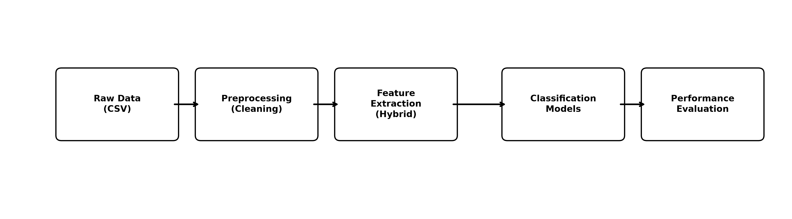
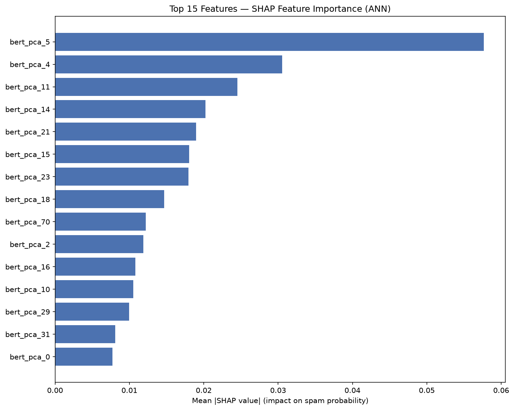

# Turkish Spam Detection System

A hybrid spam detection system for Turkish e-commerce reviews using BERTurk + TF-IDF feature fusion with weak supervision.



## Description

This project implements a machine learning pipeline for detecting spam in Turkish e-commerce product reviews. The system combines:

- **Weak Supervision**: Automatically generates training labels from heuristic spam signals (brevity, emoji, URL presence, excessive capitalization, repeated characters, and punctuation patterns). Note: since labels are rule-generated rather than human-annotated, reported metrics reflect how well the models learn the labeling heuristics, not agreement with human ground truth.
- **Hybrid Feature Fusion**: Concatenates TF-IDF features with PCA-reduced BERT embeddings (from BERTurk) for a richer text representation
- **Class Balancing**: Random oversampling of the minority (spam) class on the training split only
- **Multi-Model Evaluation**: Compares 4 classification models (Logistic Regression, Random Forest, LightGBM, ANN)
- **Comprehensive Visualizations**: System architecture, confusion matrices, AUC curves, t-SNE plots, word clouds, and feature importance analysis


## Dataset

The raw dataset (`data/veri_seti_200k.csv`, ~203k Turkish e-commerce reviews) is **not included in the repository** due to its size. Place your own CSV at `data/veri_seti_200k.csv` (one review per line, single header row) before running the pipeline. The path is configurable via `DATA_PATH` in `config.py`.

## Installation

```bash
# Clone the repository
git clone https://github.com/embikaa/turkish_spam_detection.git
cd turkish_spam_detection

# Create virtual environment
python -m venv venv

# Activate virtual environment
# On Linux/macOS:
source venv/bin/activate
# On Windows:
venv\Scripts\activate

# Install dependencies
pip install -r requirements.txt
```

### Requirements

- Python 3.8+
- PyTorch
- Transformers (HuggingFace)
- scikit-learn
- LightGBM
- imbalanced-learn
- nltk
- matplotlib, seaborn
- wordcloud

See `requirements.txt` for the full, pinned dependency list.

## Usage

### Running the Full Pipeline

```bash
# Execute the complete pipeline
python main.py
```

The pipeline will:
1. Load data from `data/veri_seti_200k.csv`
2. Apply weak supervision labeling based on spam signals
3. Clean and split the data (train/test)
4. Extract hybrid features (TF-IDF + BERT with PCA)
5. Scale features and oversample the minority class on the training split
6. Train and evaluate 4 classification models
7. Generate visualizations in the `results/` directory

**Note:** this step clears out any existing `.png` files in `results/` before regenerating them (see `visualize.py`'s `clean_old_plots`). Run this **before** `explainability.py` (below), not after, or you'll wipe the SHAP plot.

### Training & Persisting a Model

```bash
# Train the ANN pipeline and save all artifacts to models/
python save_model.py
```

This writes `tfidf_vectorizer.joblib`, `pca_model.joblib`, `scaler.joblib`, `best_model.joblib`, and `model_info.json` into `models/`.

### Ablation Study

```bash
# Compares TF-IDF only vs. BERT only vs. hybrid features
python ablation.py
```

### Explainability (SHAP)

```bash
# Requires the artifacts produced by save_model.py (run that first),
# and must be run after main.py (see note above)
python explainability.py
```

Computes SHAP values for the persisted best model (ANN) on a sample of the test set and saves a top-15 feature importance plot to `results/10_shap_top15.png`. Since the best model is not tree-based, `shap.KernelExplainer` is used, so both the background and explained sample sizes are kept small (configurable via `Config.SHAP_BACKGROUND_SIZE` / `Config.SHAP_EXPLAIN_SIZE`) to keep runtime reasonable.

### Configuration

Edit `config.py` to customize the following parameters:

| Parameter | Default | Description |
|-----------|---------|-------------|
| `DATA_PATH` | `data/veri_seti_200k.csv` | Input data file path |
| `BERT_MODEL` | `dbmdz/bert-base-turkish-cased` | BERT model for embeddings |
| `MAX_LENGTH` | `128` | Max token length for BERT |
| `BATCH_SIZE` | `32` | BERT inference batch size |
| `SAMPLE_SIZE` | `None` | Subsample size (`None` = use full dataset) |
| `SPAM_THRESHOLD` | `1.0` | Min. number of spam signals to label a text as spam |
| `TFIDF_FEATURES` | `500` | Maximum TF-IDF features |
| `PCA_COMPONENTS` | `256` | BERT dimensions after PCA |
| `TEST_SIZE` | `0.2` | Test split fraction |
| `OVERSAMPLING_RATIO` | `1.0` | Minority:majority ratio after oversampling |
| `SHAP_BACKGROUND_SIZE` | `100` | Background samples used to approximate E[f(x)] for SHAP |
| `SHAP_EXPLAIN_SIZE` | `200` | Test samples SHAP values are computed for |
| `SHAP_TOP_N` | `15` | Number of top features shown in the SHAP plot |

### Model Comparison Results


### Best Model Performance

The best-performing model (ANN) achieves the following on the held-out test set:

| Metric | Score |
|--------|-------|
| Accuracy | 93.4% |
| F1 | 88.84% |
| Precision | 90.77% |
| Recall | 87.0% |
| AUC | 97.08% |

### Visualizations Generated

`main.py` generates 10 analysis plots saved to `results/`, and `explainability.py` generates one more:

| File | Description |
|------|-------------|
| `0_system_architecture.png` | High-level system/pipeline architecture |
| `1_label_distribution.png` | Distribution of spam vs ham labels |
| `2_oversampling_effect.png` | Impact of random oversampling |
| `3_best_model_cm.png` | Confusion matrix of best model |
| `4_top3_comparison.png` | Performance comparison of top 3 models |
| `5_auc_curve.png` | ROC-AUC curves for all models |
| `6_wordclouds.png` | Word clouds for spam and ham reviews |
| `7_tsne_plot.png` | t-SNE visualization of feature space |
| `8_pca_variance.png` | PCA variance explanation |
| `9_feature_importance.png` | Feature importance analysis (model-native, e.g. LightGBM/Random Forest importances) |
| `10_shap_top15.png` | Top 15 features by mean absolute SHAP value for the best model (via `explainability.py`) |




## Project Structure

```
turkish_spam_detection/
├── config.py              # Configuration settings
├── preprocessing.py       # Turkish text cleaning and stemming
├── labeling.py            # Weak supervision heuristics
├── features.py            # TF-IDF and BERT feature extraction
├── train.py               # Model training and evaluation
├── visualize.py           # Analysis plots generation
├── main.py                # Pipeline orchestration (train + evaluate + plot)
├── save_model.py          # Train ANN pipeline and persist artifacts
├── ablation.py            # TF-IDF vs. BERT vs. hybrid ablation
├── explainability.py      # SHAP feature importance for the persisted model
├── requirements.txt       # Python dependencies
├── data/                  # Input data (not included in repo)
├── models/                # Persisted model artifacts
└── results/               # Generated visualizations
```

## Contributing

We welcome contributions! To contribute:

1. **Fork** the repository
2. **Create a feature branch** (`git checkout -b feature/YourFeature`)
3. **Make your changes** and ensure code follows existing patterns
4. **Test thoroughly** with the existing pipeline
5. **Commit** your changes (`git commit -m 'Add some feature'`)
6. **Push** to the branch (`git push origin feature/YourFeature`)
7. **Open a Pull Request** with a clear description of your changes

### Guidelines

- Follow PEP 8 style guidelines for Python code
- Add docstrings to new functions and classes
- Ensure new features work with the existing configuration system
- Test changes with the full pipeline before submitting

## License

This project is licensed under the **MIT License**. See [LICENSE](LICENSE) for details.

*Built with BERTurk + TF-IDF hybrid feature fusion for Turkish language spam detection.*
